 

---

### `$ cat sobre.md`

Gustavo Henrique Mota Lima. Estudante de **Análise e Desenvolvimento de Sistemas**
na FATEC Itapetininga, com formação técnica em Informática pelo Instituto Federal.
Minha área é desenvolvimento, suporte técnico e informática administrativa.

- Hoje estou construindo o **byte-games** — loja de games em Spring Boot 3, com
  vitrine, busca, carrinho em sessão e CRUD de produtos, categorias e FAQ.
- Estudando **estruturas de dados e algoritmos em C++**, implementados do zero
  pra entender o custo de cada operação.
- Aberto a conversar sobre **Java, back-end e suporte técnico**.
- Pergunte-me sobre qualquer coisa em `#backend` ou `#suporte`.

 

### `$ ls ./stack`

  
  
  
  
  
  

  
  
  
  
  
  

 

### `$ ./stats --live`

 

 

### `$ ./contribuicoes --animado`

 

### `$ ./contato`

  
  

 

  

